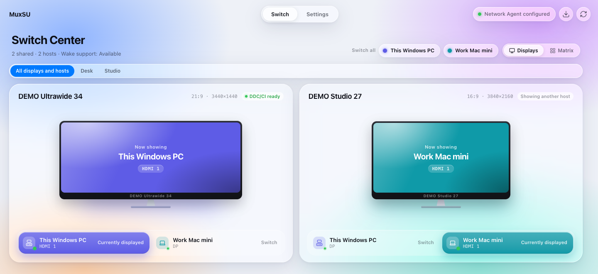
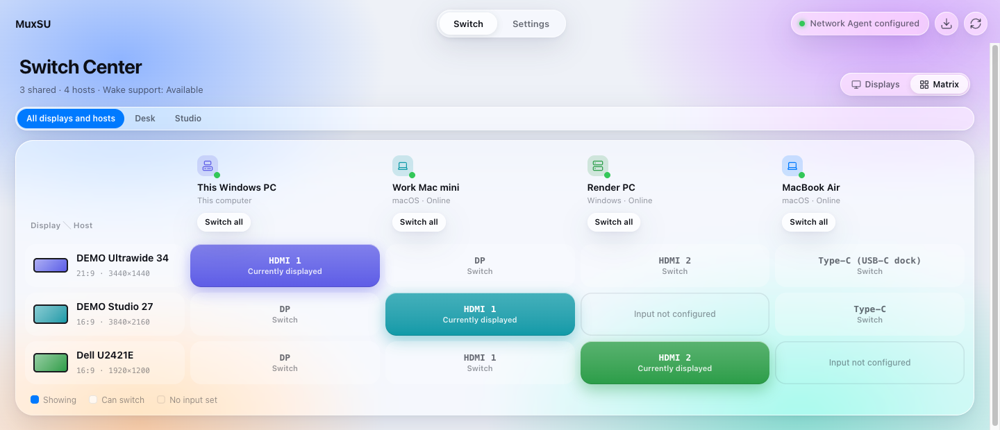
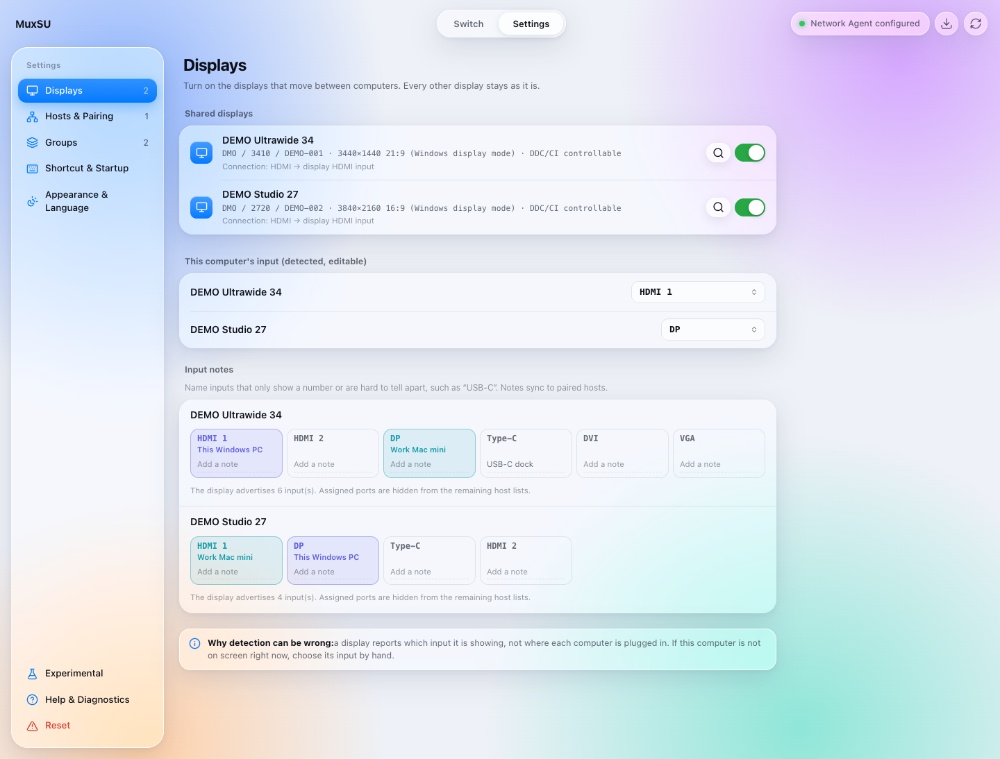
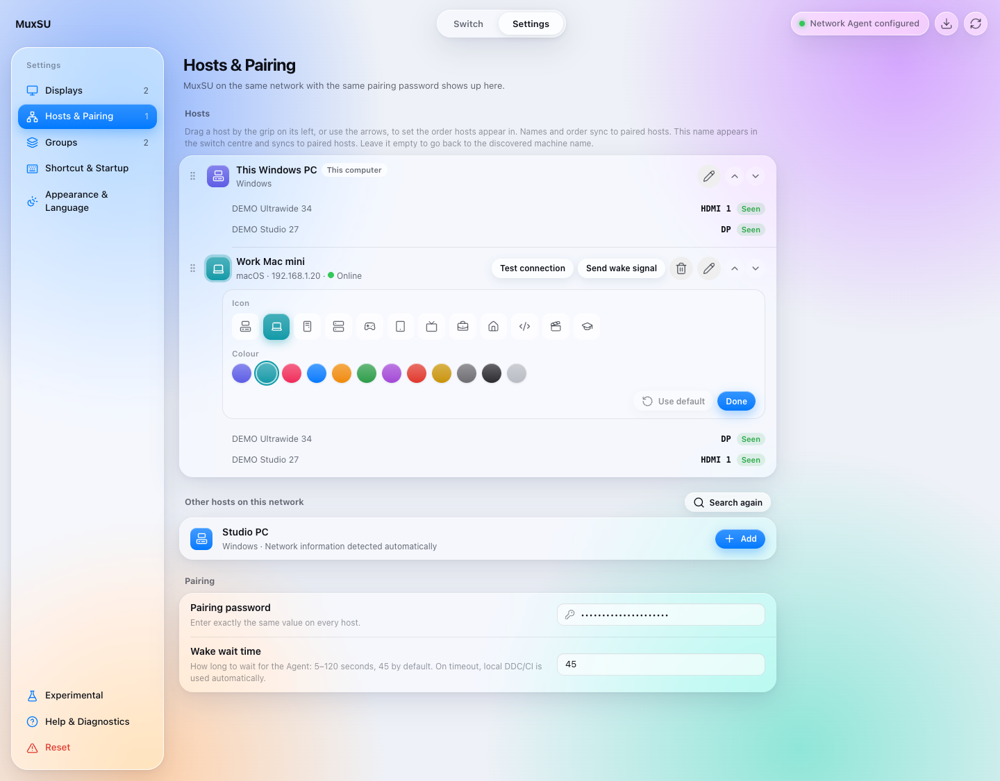
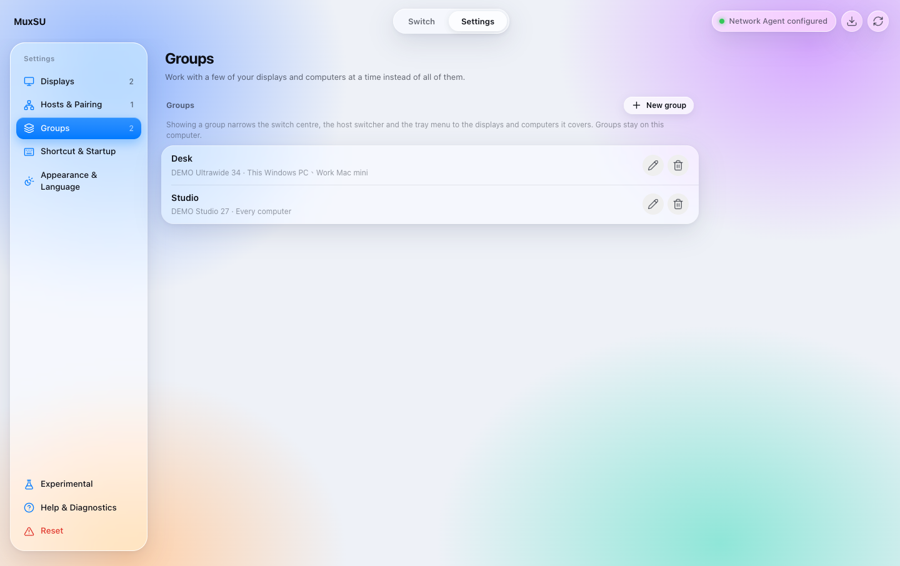
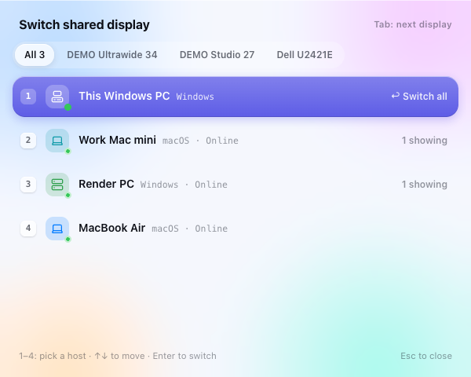
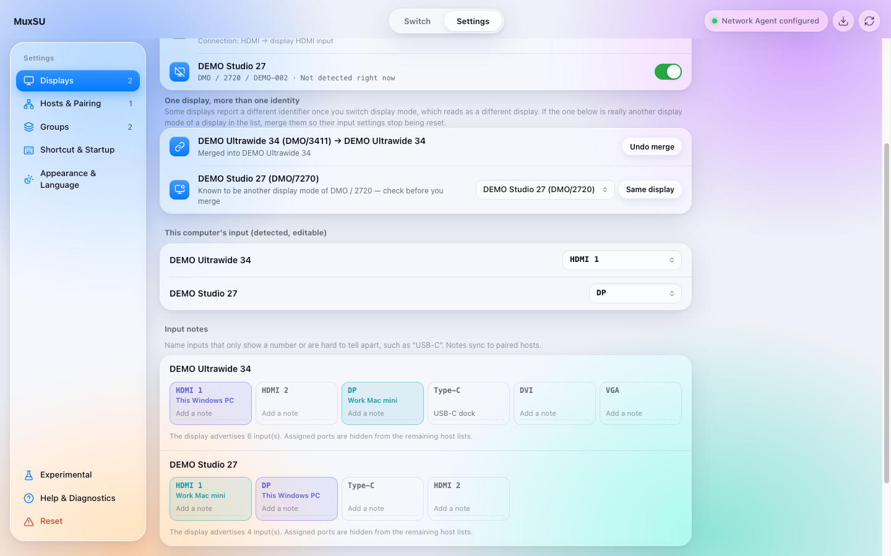

# MuxSU

[繁體中文](README.md) | English

> MuxSU extends [DisplayMux](https://github.com/HenryHsu/DisplayMux) by Henry Hsu, under the MIT licence.
> The original switches one shared monitor between two computers; this project builds on it so the two hosts work
> out each other's ports, display identities and settings between themselves, leaving less to be entered by hand.
> Release history before v0.1.6 points at the original project.

MuxSU is a desktop utility for Windows 10/11 and macOS 12+ that lets multiple computers share a single monitor. It switches the monitor input directly from your computer, so you do not need to reach for the monitor's physical controls.

It controls only the shared monitor you select. It does not change your operating system's display arrangement or switch any of your other work displays.


**About the name:** MuxSU is pronounced *Mǎkè Shū* — "Mark Uncle" in Mandarin (馬克叔). *Mux* is short for
multiplexer; *SU* is *shū*, uncle. The app icon is Mark Uncle himself: each lens of his round glasses holds a
computer, and the bridge between them joins the two, which is the whole idea — two computers sharing one display.

## When MuxSU Is Useful

For example, when you have:
- One or more shared monitors connected to two computers at once
- Other dedicated displays that should not be switched (optional)

MuxSU only switches the shared monitors you select. Every other display keeps its picture and its place in the arrangement.
You can share more than one monitor; each host stores its own input port for each shared monitor separately.

## What It Does

**Detecting and setting ports**

- After you pick a shared monitor, the port this computer occupies is detected and saved for you.
- Detection has a ceiling: a display reports the input it is showing, never which one the reader is plugged into. Every port field can therefore be set by hand.
- Only the inputs a display declares are offered, minus the ports already assigned to other hosts.
- When a display's inputs cannot be read, no guessed list is offered. The field says they have not been read and keeps whatever is already set.
- Inputs are named plainly — VGA, DVI, DP, HDMI 1, HDMI 2, Type-C — with no VCP values on screen.
- Inputs that are hard to tell apart can be given a note of your own, such as "USB-C".
- Detection only reads from the display. It never cycles through ports, so nothing goes black in order to be discovered.

**What the two hosts work out between themselves**

- Adding a host that is already set up fills in the port it occupies, when that can be established safely.
- What one host learns is shared with the others: each host's port, the display's declared input list, input notes, host names, order, icons and colours, and display identity merges.
- A notice that does not arrive is said again on the next scan, until it lands.

**Switching**

- Pick the target host in the switch centre. There is no switching mode to choose.
- With several shared monitors, one action sends all of them to the same host.
- With many displays or hosts (3+ displays or 4+ hosts) the switch centre becomes a matrix — a row per display, a column per host. You can also change the view by hand.
- A global shortcut can summon a small host picker even while the main window is hidden: number keys pick a host, Tab changes the target display.
- When there are enough displays and computers that they do not all move together, group the ones that do. Choosing a group narrows the switch centre, the host switcher and the tray menu to it. Groups stay on this computer and are not shared with paired hosts.
- The tray (the menu bar on macOS) switches too: every display to one host, or each display on its own.

**Display maintenance (Re-seat signal is experimental)**

- When the picture does not arrive on an input that is already correct, the display can be sent out through a paired host's input and straight back, so it re-establishes the link to this computer. A display's built-in USB hub or KVM follows the active input, so the keyboard and mouse come back with it.
- Once the display leaves this computer, only the host it is then showing can switch it back. MuxSU asks that host to answer first, and moves nothing when it does not. Turn this on under Experimental in settings; it is hidden by default.
- Re-detection reads which inputs the display accepts, and which one it is showing, from the display again. What is stored is kept when nothing can be read. It only reads, and is not experimental.

**Also**

- Each host can wear an icon and a colour (12 icons, 10 colours), which the switch centre, the switcher and settings use to tell hosts apart.
- When one display reports different identities in different display modes, you can declare that they are the same display.
- Reset comes in two scopes: displays only, or back to a fresh installation.
- The interface is available in English and Traditional Chinese, in light and dark appearance.

## Screenshots

The computer names, addresses and display details shown below are anonymized sample data.

### Switch Center

Which computer each shared monitor is currently handed to, and the input each one uses; the screen takes on the colour of the host it shows. With more than one shared monitor, a control at the top sends all of them to the same host at once. Once groups exist, a row of them appears under the heading, and choosing one shows only the displays and computers it covers.



With more displays or hosts, the matrix view shows at a glance which host every display is on. Click any cell to switch it; "Switch all" above a column hands every display to that host.



### Settings › Displays

Choosing shared monitors, this computer's port on each of them, and input notes.



### Settings › Hosts & Pairing

Added hosts and their inputs, other hosts found on the network, and the pairing password. The pencil next to a host renames it and changes its icon and colour.



### Settings › Groups

Name the displays and computers you use together. Ticking nothing in either half covers all of that half. Groups stay on this computer and are not shared with paired hosts.



## Before You Begin

Check that:

1. The shared monitor supports DDC/CI.
2. DDC/CI is enabled in the monitor's OSD menu.
3. Every computer taking part has MuxSU installed and running.
4. The computers you want to pair are on the same private local network.
5. Every computer has exactly the same pairing password, at least 15 characters long.

A monitor that shows a picture is not necessarily passing DDC/CI through the cable, adapter or dock you are using. If no monitor is detected, start with [Connection and Compatibility Limitations](#connection-and-compatibility-limitations) below.

## Quick Setup

### 1. Select the Shared Monitor

Open Settings › Displays and refresh the monitor list:

- On first setup, if there is exactly one controllable external monitor, MuxSU selects it for you.
- Otherwise choose by hand. You can select more than one shared monitor.
- Once you have made a choice — including removing a monitor from sharing, or running a reset — nothing is selected for you again, and a monitor you removed stays removed.

MuxSU locks on to the monitor's manufacturer, model and serial number. It never guesses from **primary display** or display arrangement order.

### 2. Confirm This Computer's Port

After you select a monitor, MuxSU reads its current input right away and saves the port this computer uses.

What detection reads is which input the display is showing. If this computer is not on that display at the time, there is nothing to detect — choose the port you actually plugged into from the list. A port set by hand is shared with the other hosts exactly like a detected one.

Ports appear as VGA, DVI, DP, HDMI or Type-C, so there are no technical codes to look up.

### 3. Set a Pairing Password

In Settings › Hosts & Pairing, enter exactly the same pairing password on every computer, at least 15 characters long.

The password signs and verifies the requests hosts make of each other on the local network — asking for status, asking another host to perform a switch, and sending a wake. Hosts with different passwords cannot control each other.

### 4. Add Other Hosts

In Settings › Hosts & Pairing, find the other computer under "Other hosts on this network" and press Add.

If that computer has already selected its shared monitor, MuxSU fills in the port it uses when all of the following hold:

- The pairing password verifies
- Both computers identify the same monitor
- The other computer's port is an input this monitor can use
- That port is not already assigned to this computer or another host

When this cannot be established safely, set that computer’s port on that computer. Each computer sets only its own port and cannot assign one for another host, and MuxSU does not guess which port another computer is plugged into.

Both hosts must use the same MuxSU Agent protocol version. When they differ, MuxSU rejects the connection before accepting remote data or performing a switch.

### 5. Save and Repeat on the Other Computers

Most settings are saved as you change them: which monitors are shared, this computer's input port, input notes, host names, order, icons and colours, and display identity merges.

These five wait for the Save button, and a note with a cancel appears at the bottom of the form while one of them is waiting:

- Pairing password
- Wake wait in seconds
- Start at login
- Check for updates at startup
- The global host switcher and its shortcut

Repeat the same steps on every computer taking part. Turning on "Start at login" is recommended, so the other hosts can find, wake and ask this computer to perform a switch.

## Everyday Use

Once set up, pick the target host in the switch centre. With several shared monitors, "All displays" sends every one of them to the same host in a single action.

When switching to a remote host, MuxSU:

1. Attempts to wake the target host over Wake-on-LAN.
2. Checks whether the target host's MuxSU Agent is ready.
3. Prefers switching the shared monitor over DDC/CI from this computer.
4. Falls back to asking a verified remote host to perform the switch if the local DDC/CI path fails.

If the network Agent is temporarily unreachable, MuxSU still tries local DDC/CI. If the target computer is not yet producing a picture, the monitor may go briefly black.

On Windows, closing or minimizing the window leaves the app running in the system tray. Only "Quit MuxSU" from the tray actually exits.

The tray menu (the menu bar icon on macOS) switches too: "Switch every display to" lists each host, and each shared display has a submenu of its own, with a check next to the host it is showing.

A switch made from the menu has no window to report back to, so the menu itself carries the progress: its heading becomes "Switching to <host>…", every host below it is unclickable, and clicking again does not queue a second switch. A switch still running after 1.2 seconds also opens a small panel naming the host; one that fails replaces it with the display that failed and why. Got it, Enter or Esc dismisses it.

### Global Host Switcher

With "Global host switcher" enabled in Settings › Shortcut & Startup, a shortcut (`Ctrl/Cmd + Alt + Space` by default) summons a small window for handing the shared monitor to another host, without returning to the main window first. You can record your own shortcut; the app checks it against common application shortcuts before accepting it.

In the window, number keys pick a host directly, the arrow keys move and Enter switches. With several shared displays, Tab moves the target between all of them and each one on its own; Esc closes it.



## One Display, Different Identities

Some displays report a different identity when they change display mode — from 4K to 1080p, say — so the list makes it look as though a different monitor arrived, and the sharing and port settings that belonged to it appear to vanish.

When that happens, Settings › Displays lists the identity that belongs to no shared display, and you can merge it into one already in the list: this is the same display. From then on the two identities count as one monitor, switching and port settings carry over, and the declaration is shared with paired hosts. A merge can be undone.

A merge only decides which identities count as the same display. It does not relax the safety check on switching: before any DDC/CI command goes out, the display's identity must still match exactly.



## Reset

Two scopes are offered under Settings › Reset (bottom left of the sidebar), each needing a second press to confirm:

- **Reset display settings** — clears shared monitors, identity merges and input notes. Paired hosts and the pairing password are kept.
- **Reset everything** — back to a fresh installation, including paired hosts and the pairing password. This computer's host identity is kept, so there is nothing to clear on the other computer.

A reset cannot be undone. Nothing is selected for sharing again afterwards.

## Input Port List

MuxSU uses the input list the display itself provides, minus the ports already assigned.

If the display, hub, dock or adapter cannot provide one, no guessed list is offered. The field says the display's inputs have not been read and keeps the current setting. A generic list describes no particular display, and on a given one every entry may be wrong — and a wrong port aims the switch at an input with nothing on it.

If another paired host can read that display, it shares what it found and the field becomes usable again.

Some displays use vendor-specific values for Type-C or other inputs. MuxSU keeps the raw value the display reported for switching, but shows "Other input" when it cannot name it with confidence, rather than labelling it wrongly. You can give such an input a note of your own.

After changing a monitor, cable, dock or the port you are actually plugged into, select the shared monitor again and check each host's settings.

## Monitor Not Found or Unable to Switch

Check, in order:

1. DDC/CI is enabled in the monitor's OSD.
2. The selected monitor is the external shared one, not a laptop's built-in panel.
3. Test with a direct cable between the monitor and the computer.
4. Temporarily remove any KVM, adapter or dock to see whether the problem sits in between.
5. Refresh MuxSU's monitor and host lists.
6. Confirm both computers use the same pairing password and that their clocks are correct.
7. Confirm the firewall allows mDNS and the MuxSU Agent on private networks.

If a direct connection can control the monitor but a dock only carries the picture, the dock or its driver is not passing DDC/CI through. Pairing again cannot restore a hardware channel that is not there.

## Connection and Compatibility Limitations

### Windows

Windows enumerates and controls physical monitors through the system DDC/CI interface. Only monitors whose current input can actually be read appear in the selectable list.

### macOS

Whether DDC/CI works on macOS depends on the Mac model, the macOS version, the port, and whether the cable, adapter or dock passes the signal through intact.

Connections with a better chance of working:

- Mac mini built-in HDMI, connected directly
- Thunderbolt to DisplayPort, connected directly
- Thunderbolt to HDMI

These may carry the picture without offering DDC/CI to third-party software:

- Some MST docks
- DisplayLink docks
- Silicon Motion InstantView / SM76x / SM77x devices
- HDMI or USB-C adapters that do not pass DDC through

A DisplayLink or dock utility being able to change brightness does not mean MuxSU can reach the physical monitor's control channel.

## Wake-on-LAN and Networking

- mDNS uses `5353/UDP` to find MuxSU hosts on the same local network.
- The MuxSU Agent uses `47653/TCP` by default.
- On macOS, enable "Wake for network access".
- On Windows, enable Wake-on-LAN in the network adapter and in BIOS/UEFI.
- Whether a fully powered-off computer can be woken depends on its hardware, firmware and operating system settings. MuxSU cannot guarantee it.

IP addresses and the Agent port are picked up and stored while searching for hosts. MAC addresses are never broadcast; each host sends its own in authenticated replies. After a DHCP address changes, searching again updates them; a paired host that has moved is only followed once an authenticated connection confirms it.

## Security and Privacy

- MuxSU only controls the single target whose full monitor identity matches.
- The operation stops if the target is missing, the identity is incomplete, or several matching monitors appear at once.
- Requests between paired hosts are verified with HMAC-SHA256, a time limit and nonce replay protection.
- Pairing passwords are stretched with PBKDF2-HMAC-SHA256; the complete Agent response and its protocol version are authenticated as well.
- The pairing password is never written to ordinary operation logs.
- Wake-on-LAN packets only wake a computer. They do not authorize a switch.
- mDNS only broadcasts what host discovery needs, on the local network.
- Update checks send no pairing password, monitor settings, computer name, local address or monitor identity.

## Installation and Updates

Download the Windows installer or the macOS Universal DMG from a trusted MuxSU GitHub Release.

MuxSU can check GitHub Releases for a newer version, but never downloads or installs one without confirmation. Once you choose to install, the update package's signature is verified first.

### Upgrading from Before the Rename

The app was renamed from DisplayMux to DisplayMuxAuto in v0.1.11 and has now been fully renamed to **MuxSU**. MuxSU uses a new app identifier, so it does not read settings, pairings, language, or theme preferences from older versions. Configure them again after upgrading.

- **Windows**: the installer removes an old DisplayMux or DisplayMuxAuto install and its autostart entry before installing MuxSU.
- **macOS**: remove the old app and install `MuxSU.app` again so that its filename and new app identity agree.

### macOS Gatekeeper

The macOS DMG is currently ad-hoc signed, not signed and notarized with an Apple Developer ID. On first launch, Gatekeeper may ask for manual approval:

1. Drag `MuxSU.app` to `/Applications` and try opening it once.
2. Open System Settings → Privacy & Security.
3. Find MuxSU under Security and press "Open Anyway".
4. Authenticate and confirm.

Only allow it when you are sure the app came from this project's trusted release. See Apple's [Open apps safely on your Mac](https://support.apple.com/102445) for details.

## Development and Building

Requirements: Rust 1.85+, Node.js 22+, pnpm 10+. Building on macOS also needs the Xcode Command Line Tools.

```powershell
pnpm install --frozen-lockfile
pnpm tauri dev
```

Full verification:

```powershell
pnpm build
cargo test --workspace
cargo fmt --all -- --check
cargo clippy --workspace --all-targets -- -D warnings
```

Production bundles:

```powershell
pnpm tauri build
```

On macOS, a dedicated script builds an ad-hoc signed Universal DMG:

```bash
./scripts/build-macos-dmg.sh
```

Artifacts land in `target/release/bundle/`. Windows produces an NSIS installer by default; macOS produces `.app` and `.dmg`.

### CLI Diagnostics

The CLI is Windows-only and is meant for developers diagnosing monitor identification and switching. It is not part of normal use:

```powershell
cargo run -p muxsu-cli -- list
cargo run -p muxsu-cli -- switch <manufacturer> <product> <serial|-> <input> --dry-run
```

Only drop `--dry-run` once you have confirmed the target is correct.

## License

MuxSU is released under the [MIT License](LICENSE), keeping the original DisplayMux copyright notice.
