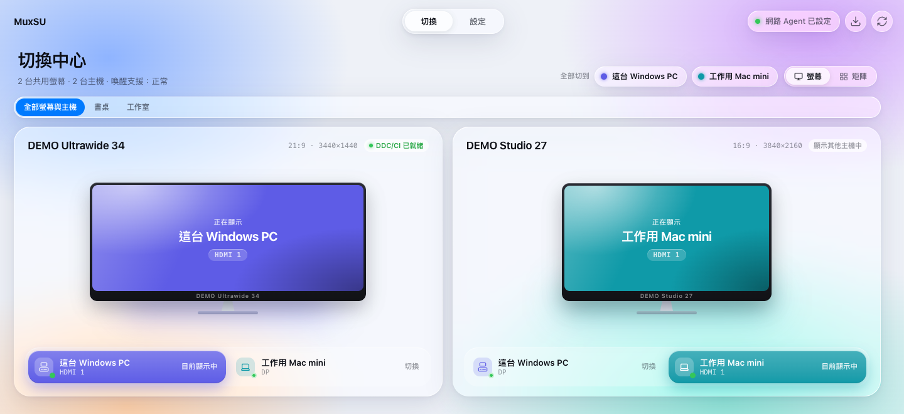
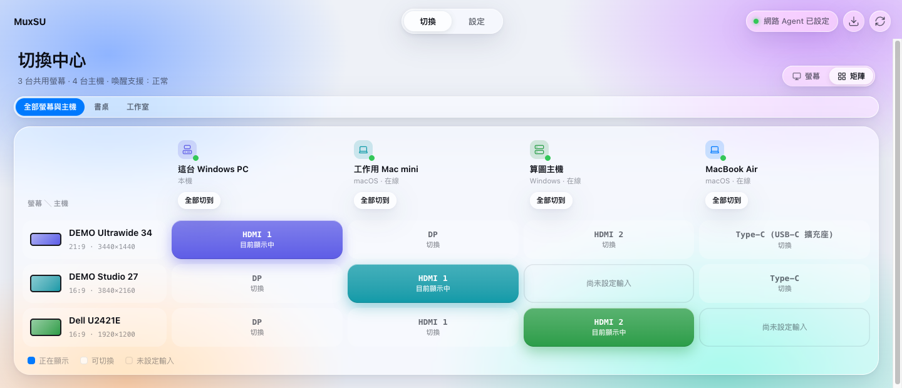
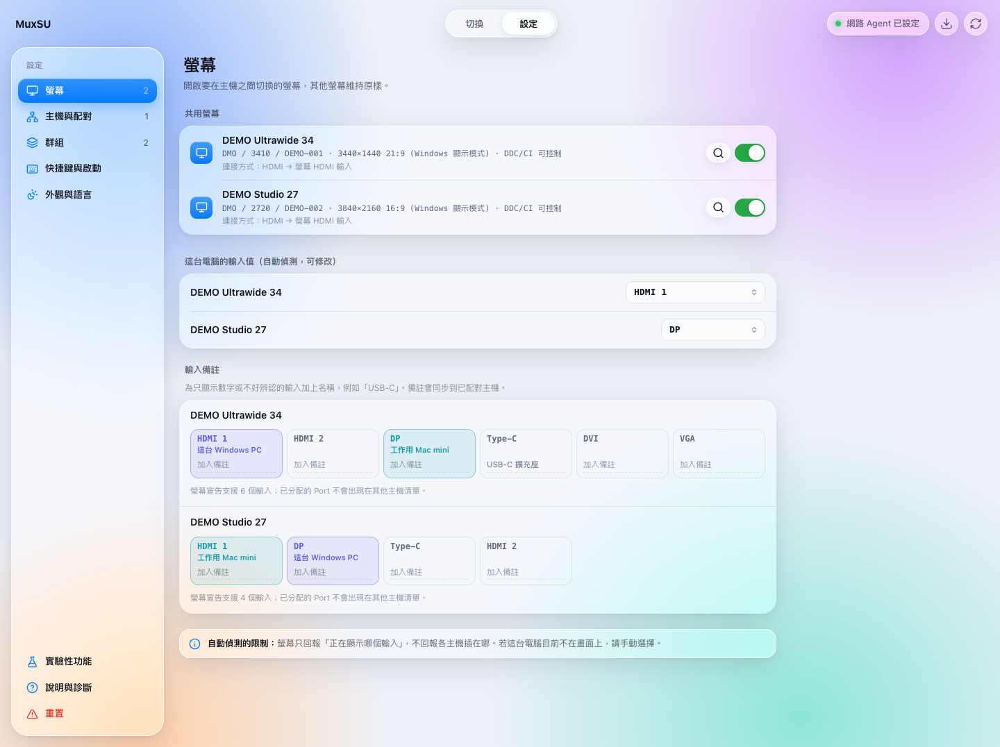
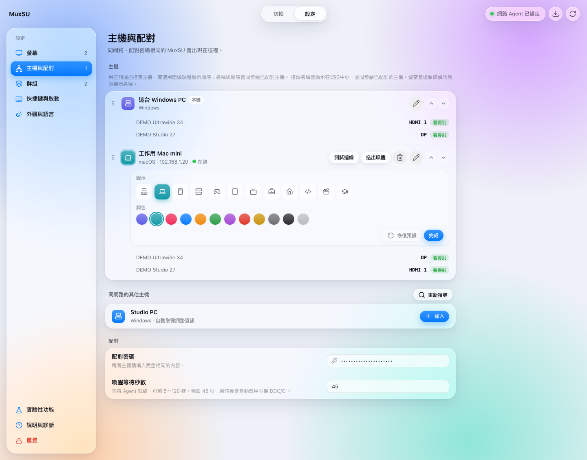
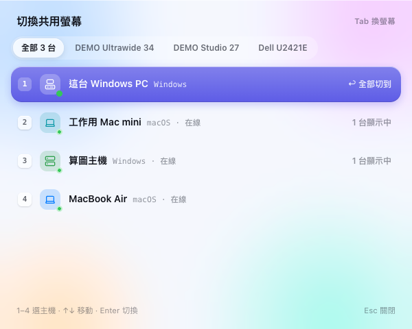
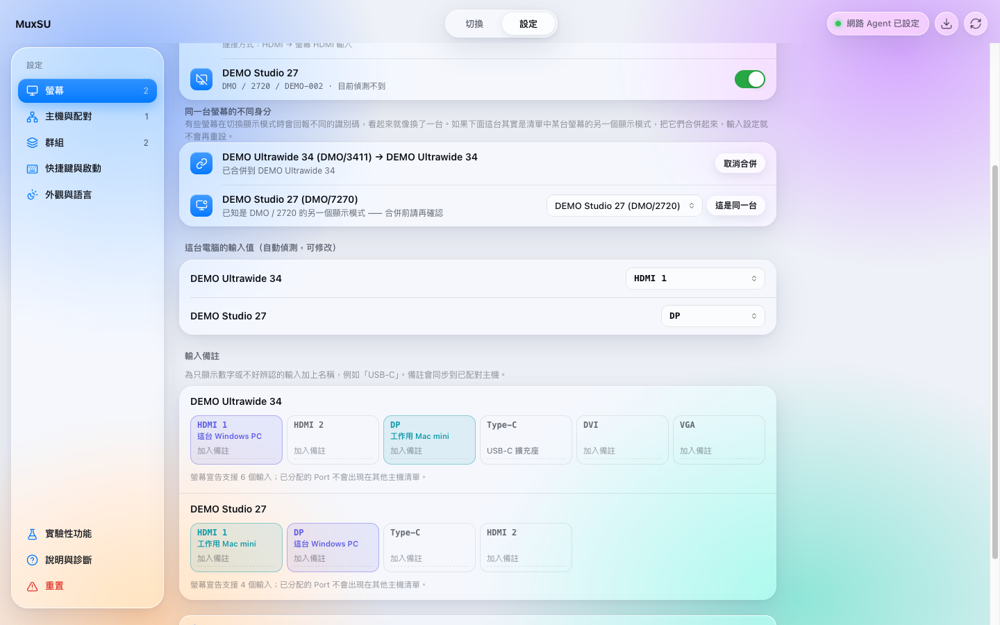

# MuxSU

繁體中文 | [English](README.en.md)

> MuxSU 是 [DisplayMux](https://github.com/HenryHsu/DisplayMux)（作者 Henry Hsu，MIT 授權）的延伸開發版本。
> 原專案負責把一台共用螢幕在兩台電腦之間切換；本專案在其基礎上，讓兩台主機自動協調彼此的接口、螢幕身分與設定，
> 減少手動輸入。v0.1.6 以前的版本紀錄指向原專案。

MuxSU 是一款適用於 Windows 10／11 與 macOS 12+ 的桌面工具，讓多台電腦共用同一台螢幕時，可以直接從電腦切換螢幕輸入，不必伸手操作螢幕按鍵。

它只控制你選定的共用螢幕，不會改變作業系統的螢幕排列，也不會切換其他工作螢幕。


**名字由來：** MuxSU 唸作「馬克叔」。Mux 取自 multiplexer（多工切換），SU 就是「叔」。
App 圖示就是馬克叔本人：他的兩片圓眼鏡裡各有一台電腦，中間的鏡橋把它們連在一起，代表兩台電腦共用同一台螢幕。

## 適合的使用情境

例如你有：
- 一台或多台同時連接兩台電腦的共用螢幕
- 其他不需要切換的專用螢幕（非必要）

MuxSU 只會切換你指定的共用螢幕。其他螢幕會保持原本的畫面與排列。
共用螢幕可以選取多台；每台主機會為每一台共用螢幕分別保存自己使用的輸入 Port。

## 主要功能

**接口偵測與設定**

- 選擇共用螢幕後，自動偵測並保存這台電腦目前使用的輸入 Port。
- 自動偵測有其極限：螢幕回報的是它正在顯示哪個輸入，不是讀取者插在哪。因此每個接口欄位都可以手動修改。
- 只列出螢幕自己宣告支援的輸入，並排除已經分配給其他主機的 Port。
- 讀不到螢幕的輸入清單時不會改用猜測的選項；欄位會說明尚未讀取到，並保留現有設定。
- 輸入選單使用容易理解的名稱：VGA、DVI、DP、HDMI 1、HDMI 2、Type-C；不顯示 VCP 技術數值。
- 可以為不好辨認的輸入加上備註，例如「USB-C」。
- 接口偵測只讀取螢幕資訊，不會逐一切換 Port，所以不會為了偵測而造成黑畫面。

**兩台主機之間的自動協調**

- 加入另一台已設定好的主機時，若能安全確認，會自動帶入對方使用的 Port。
- 一台主機讀到的資訊會同步給其他主機：各自的接口、螢幕宣告的輸入清單、輸入備註、主機名稱、順序、圖示與顏色、螢幕身分合併。
- 通知若沒有送達，會在下次搜尋時重送，直到對方收到為止。

**切換**

- 在切換中心選擇目標主機即可，不需要選擇切換模式。
- 共用螢幕有多台時，可以一鍵把全部螢幕切換到同一台主機。
- 螢幕或主機一多（3 台以上螢幕或 4 台以上主機），切換中心會改用矩陣檢視：一列一台螢幕、一欄一台主機，也可以手動切換檢視方式。
- 可以開啟全域快捷鍵，即使主視窗隱藏也能叫出主機切換器小視窗，用數字鍵選主機、Tab 換目標螢幕。
- 系統匣（macOS 為選單列）也能直接切換：把全部螢幕切到某台主機，或個別切換每台螢幕。

**其他**

- 每台主機可以挑選圖示與代表色（12 個圖示、10 種顏色），切換中心、切換器與設定頁都用它來辨認主機。
- 同一台螢幕在不同顯示模式下回報不同識別碼時，可以手動宣告「這是同一台」。
- 重置分兩種範圍：只清螢幕設定，或回到全新安裝的狀態。
- 介面支援繁體中文與英文、淺色與深色外觀。

## 實際操作畫面

以下畫面中的電腦名稱、位址與螢幕資訊皆為匿名展示資料。

### 切換中心

可以直接看到每台共用螢幕目前交給哪台電腦，以及各自使用的輸入；螢幕畫面會染上正在顯示的主機顏色。共用螢幕不只一台時，上方會出現把全部螢幕一次切換過去的按鈕。



螢幕或主機比較多時改用矩陣檢視，一眼看完每台螢幕正在顯示哪台主機；點任一格就切換，欄位上方的「全部切到」會把所有螢幕交給那台主機。



### 設定 › 螢幕

選擇要共用的螢幕、這台電腦在每台螢幕上的輸入 Port，以及輸入備註。



### 設定 › 主機與配對

已加入的主機與它們的輸入、同網路找到的其他主機，以及配對密碼。按主機旁的鉛筆可以改名、換圖示與顏色。



## 使用前準備

開始前請確認：

1. 共用螢幕支援 DDC/CI。
2. 已在螢幕的 OSD 設定中開啟 DDC/CI。
3. 每台要參與切換的電腦都已安裝並啟動 MuxSU。
4. 要互相配對的電腦位於同一個私人區域網路。
5. 每台電腦都設定完全相同、至少 15 個字元的配對密碼。

螢幕能正常顯示畫面，不一定代表目前使用的線材、轉接器或 Dock 也有轉送 DDC/CI。若偵測不到螢幕，請先參考下方的[連接與相容性限制](#連接與相容性限制)。

## 快速設定

### 1. 選擇共用螢幕

開啟「設定 › 螢幕」並重新整理螢幕清單：

- 第一次設定時，若只有一台可控制的外接螢幕，MuxSU 會自動選取。
- 其他情況請手動選擇；可以選取多台共用螢幕。
- 你做過選擇之後（包含把螢幕移出共用、或執行重置）就不會再自動選取，移出的螢幕不會自己回來。

MuxSU 會使用螢幕的製造商、型號與序號鎖定目標，不會依照**主螢幕**或螢幕排列順序猜測。

### 2. 確認這台電腦的輸入 Port

選擇螢幕後，MuxSU 會立即讀取目前輸入，並自動保存這台電腦使用的 Port。

自動偵測讀到的是螢幕正在顯示哪個輸入。如果這台電腦當下沒有顯示在那台螢幕上，就無從偵測；這時請直接從下拉選單選擇你實際接上的 Port。手動設定的值會和自動偵測的值一樣同步給其他主機。

介面會直接顯示 VGA、DVI、DP、HDMI 或 Type-C 等名稱，不需要查詢技術代碼。

### 3. 設定配對密碼

在「設定 › 主機與配對」為所有電腦輸入完全相同的配對密碼，至少 15 個字元。

這組密碼用來簽署並驗證區域網路內主機之間的要求，例如查詢狀態、請求對方代為切換螢幕，以及送出喚醒。密碼不相同的主機無法互相控制。

### 4. 加入其他主機

在「設定 › 主機與配對」的「同網路的其他主機」中找到另一台電腦，然後按下「加入」。

如果對方已完成共用螢幕設定，MuxSU 會在下列條件全部成立時自動填入它使用的 Port：

- 配對密碼驗證成功
- 雙方選擇的螢幕識別資訊相符
- 對方的 Port 是這台螢幕可使用的輸入
- 該 Port 尚未分配給本機或其他主機

若無法安全確認，請到那台電腦上設定它自己的 Port。每台電腦只能設定自己的 Port，無法替其他主機指定，MuxSU 也不會猜測另一台電腦接在哪個 Port。

兩台主機必須使用相同的 MuxSU Agent 協議版本；版本不同時，MuxSU 會在採用任何遠端資料或執行切換前拒絕連線。

### 5. 儲存並在其他電腦重複設定

大部分設定改了就立即保存，包含共用螢幕的選取、這台電腦的輸入 Port、輸入備註、主機名稱、順序、圖示與顏色，以及螢幕身分合併。

以下五項需要按下「儲存設定」才會生效，改動時畫面下方會出現提示與取消鍵：

- 配對密碼
- 喚醒等待秒數
- 登入後自動啟動
- 啟動後自動檢查更新
- 全域主機切換器與其快捷鍵

在其他參與切換的電腦上完成相同步驟。建議開啟「登入後自動啟動」，讓其他主機可以搜尋、喚醒並要求這台電腦協助切換。

## 日常使用

設定完成後，在「切換中心」選擇目標主機即可。共用螢幕有多台時，也可以用「全部切到」一次把它們切換到同一台主機。

切換至遠端主機時，MuxSU 會：

1. 嘗試透過 Wake-on-LAN 喚醒目標主機。
2. 確認目標主機的 MuxSU Agent 是否就緒。
3. 優先從目前這台電腦透過 DDC/CI 切換共用螢幕。
4. 如果本機 DDC/CI 路徑失敗，再嘗試請已驗證的遠端主機代為切換。

網路 Agent 暫時無法連線時，MuxSU 仍會嘗試使用本機 DDC/CI。若目標電腦尚未輸出畫面，螢幕可能短暫顯示黑畫面。

Windows 版關閉或最小化視窗後會留在系統匣執行。只有從系統匣選擇「結束 MuxSU」才會真正關閉程式。

系統匣（macOS 為選單列圖示）的選單也能直接切換：「全部螢幕切到」下面列出每台主機，每台共用螢幕也各有一個子選單，勾選的是它目前顯示的主機。

從選單切換時沒有視窗可以回報進度，所以進行中的狀態由選單本身呈現：標題會變成「正在切換到 <主機>…」，底下每台主機都不能點，重複點擊不會再排一次切換。切換超過 1.2 秒還沒完成，會再彈出一個小面板說明正在切換哪一台；切換失敗則改為寫明切不過去的是哪一台主機、哪一台螢幕，以及原因，按「知道了」、Enter 或 Esc 關閉。

### 全域主機切換器

在「設定 › 快捷鍵與啟動」開啟「全域主機切換器」後，可以用快捷鍵（預設 `Ctrl/Cmd + Alt + Space`）叫出一個小視窗，直接選擇要把共用螢幕交給哪一台主機，不必先回到主視窗。快捷鍵可以自行錄製，介面會先檢查是否與常用程式衝突。

小視窗裡按數字鍵直接選主機，方向鍵移動、Enter 切換；有多台共用螢幕時按 Tab 在「全部」與各台螢幕之間切換目標，Esc 關閉。



## 同一台螢幕的不同身分

有些螢幕在切換顯示模式（例如從 4K 換成 1080p）時，會回報不同的識別碼，在清單中看起來就像換了一台螢幕 —— 原本的共用設定與接口設定也會跟著看似消失。

發生這種情況時，「設定 › 螢幕」會列出這個「不屬於任何共用螢幕」的身分，你可以把它合併到清單中已有的那一台，宣告「這是同一台」。合併之後兩個身分視為同一台螢幕，切換與接口設定都會沿用，而且這個宣告會同步給已配對的主機。合併可以取消。

合併只影響「哪些身分算同一台螢幕」，不影響切換時的安全檢查：實際送出 DDC/CI 指令前，仍然只認完整相符的 EDID 識別資訊。



## 重置

「設定 › 重置」（側欄左下角）提供兩種範圍，都需要連按兩次確認：

- **重置螢幕設定** — 清除共用螢幕、身分合併與輸入備註。配對主機與配對密碼會保留。
- **全部重置** — 回到全新安裝的狀態，包含配對主機與配對密碼。這台電腦的主機身分會保留，所以不需要到另一台電腦清除舊紀錄。

重置無法復原。重置後不會自動重新選取共用螢幕。

## 輸入 Port 清單

MuxSU 使用螢幕自行提供的輸入清單，並排除已經分配的 Port。

若螢幕、HUB、Dock 或轉接器無法提供清單，介面不會改用猜測的選項，而是顯示尚未讀取到這台螢幕的輸入，並保留目前的設定。原因是這類清單描述的是「一般螢幕」，套到特定螢幕上每一項都可能是錯的，而選錯 Port 會把畫面切到一個沒有訊號的輸入。

如果有另一台已配對主機讀得到這台螢幕，它會把讀到的清單同步過來，欄位就會恢復可用。

部分螢幕會使用廠商自訂的 Type-C 或其他輸入值。MuxSU 會保留螢幕回報的原始值供內部切換，但無法確定名稱時只會顯示「其他輸入」，避免錯誤標示。你可以為這類輸入加上自己的備註。

更換螢幕、線材、Dock 或實際連接 Port 後，請重新選擇共用螢幕並檢查每台主機的設定。

## 找不到螢幕或無法切換

請依序確認：

1. 螢幕 OSD 中的 DDC/CI 已開啟。
2. 目前選擇的是外接共用螢幕，而不是筆電內建螢幕。
3. 改用螢幕與電腦之間的直連線材測試。
4. 暫時移除 KVM、轉接器或 Dock，確認問題是否位於中間設備。
5. 重新整理 MuxSU 的螢幕與主機清單。
6. 確認兩台電腦使用相同配對密碼，且系統時間正確。
7. 確認防火牆允許私人網路上的 mDNS 與 MuxSU Agent。

若直連可以控制、經過 Dock 後只能顯示畫面，通常表示 Dock 或驅動程式沒有轉送 DDC/CI；重新配對無法補回不存在的硬體通道。

## 連接與相容性限制

### Windows

Windows 透過系統的 DDC/CI 介面列舉與控制實體螢幕。只有能實際讀取目前輸入的螢幕才會出現在可選清單。

### macOS

macOS 是否能使用 DDC/CI，取決於 Mac 型號、macOS 版本、連接埠、線材、轉接器與 Dock 是否完整轉送訊號。

通常較有機會正常運作的連接方式包括：

- Mac mini 內建 HDMI 直連
- Thunderbolt 至 DisplayPort 直連
- Thunderbolt 轉 HDMI

以下裝置可能只能輸出畫面，卻不提供第三方程式可使用的 DDC/CI：

- 部分 MST Dock
- DisplayLink Dock
- Silicon Motion InstantView／SM76x／SM77x 裝置
- 未完整轉送 DDC 的 HDMI 或 USB-C 轉接器

DisplayLink 或 Dock 自己的軟體能調整亮度，不代表 MuxSU 也能取得實體螢幕的控制通道。

## Wake-on-LAN 與網路

- mDNS 使用 `5353/UDP` 搜尋同一區域網路內的 MuxSU 主機。
- MuxSU Agent 預設使用 `47653/TCP`。
- macOS 可開啟「Wake for network access」。
- Windows 可在網卡與 BIOS／UEFI 中啟用 Wake-on-LAN。
- 完整關機後能否喚醒取決於電腦硬體、韌體與作業系統設定，MuxSU 無法保證。

IP 位址與 Agent Port 會在搜尋主機時自動取得並保存；MAC 位址不會在網路上廣播，而是由對方經過驗證的回應提供。DHCP 位址改變後，再次搜尋即可更新資料；已配對主機換位址時，要通過驗證的連線確認之後才會改用新位址。

## 安全與隱私

- MuxSU 只會控制完整螢幕識別資訊相符的唯一目標。
- 找不到目標、缺少必要識別資訊或同時出現多台相符螢幕時，操作會停止。
- 已配對主機之間使用 HMAC-SHA256、時間限制與 nonce 重播防護驗證控制要求。
- 配對密碼會先以 PBKDF2-HMAC-SHA256 衍生驗證金鑰；Agent 回應的完整內容與協議版本也會驗證。
- 配對密碼不會寫入一般操作日誌。
- Wake-on-LAN 封包只用於喚醒，不會直接授權螢幕切換。
- mDNS 只在區域網路廣播主機搜尋所需資訊。
- 更新檢查不會傳送配對密碼、螢幕設定、電腦名稱、內網位址或螢幕識別資訊。

## 安裝與更新

請從可信任的 MuxSU GitHub Release 下載 Windows 安裝程式或 macOS Universal DMG。

MuxSU 可以檢查 GitHub Releases 是否有新版本，但不會在未確認的情況下自動下載或安裝。使用者選擇安裝後，程式會先驗證更新套件簽章。

### 從改名前的版本升級

App 在 v0.1.11 從 DisplayMux 改名為 DisplayMuxAuto，目前已完整改名為 **MuxSU**。MuxSU 使用新的 App 識別碼，因此不會讀取舊版的設定、配對資料、語言或主題偏好；升級後請重新設定一次。

- **Windows**：安裝程式會先移除舊的 DisplayMux 或 DisplayMuxAuto 安裝與它們的開機啟動項，再安裝 MuxSU。
- **macOS**：建議移除舊 App 後重新安裝 `MuxSU.app`，確保檔名與新的 App 識別一致。

### macOS Gatekeeper

目前 macOS DMG 使用 ad-hoc 簽章，尚未透過 Apple Developer ID 正式簽章與公證。第一次啟動時，Gatekeeper 可能要求手動允許：

1. 將 `MuxSU.app` 拖曳到 `/Applications`，並嘗試開啟一次。
2. 開啟「系統設定」→「隱私權與安全性」。
3. 在「安全性」區域找到 MuxSU，按下「仍要打開」。
4. 完成身分驗證後再次確認。

只有在確認 App 來自本專案可信任的 Release 時才應允許執行。詳細說明可參考 Apple 的 [Open apps safely on your Mac](https://support.apple.com/102445)。

## 開發與建置

開發環境需求：Rust 1.85+、Node.js 22+、pnpm 10+。macOS 建置另需 Xcode Command Line Tools。

```powershell
pnpm install --frozen-lockfile
pnpm tauri dev
```

執行完整驗證：

```powershell
pnpm build
cargo test --workspace
cargo fmt --all -- --check
cargo clippy --workspace --all-targets -- -D warnings
```

建立正式安裝包：

```powershell
pnpm tauri build
```

macOS 可使用專用腳本建立 ad-hoc 簽章的 Universal DMG：

```bash
./scripts/build-macos-dmg.sh
```

產物位於 `target/release/bundle/`。Windows 預設產生 NSIS 安裝程式；macOS 產生 `.app` 與 `.dmg`。

### CLI 診斷

CLI 只支援 Windows，適合開發者診斷螢幕識別與切換，不是一般使用者必要流程：

```powershell
cargo run -p muxsu-cli -- list
cargo run -p muxsu-cli -- switch <manufacturer> <product> <serial|-> <input> --dry-run
```

確認目標正確後，才應移除 `--dry-run` 執行實際切換。

## 授權條款

MuxSU 採用 [MIT License](LICENSE)，並保留原專案 DisplayMux 的版權宣告。
